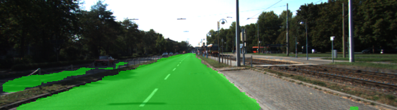
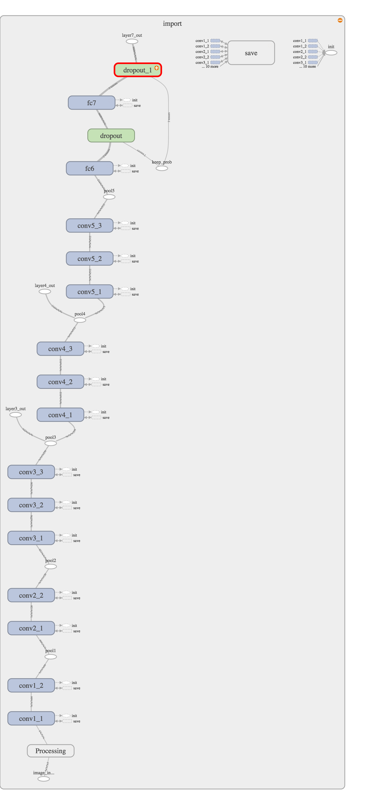
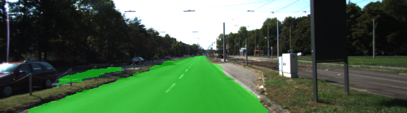
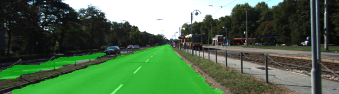
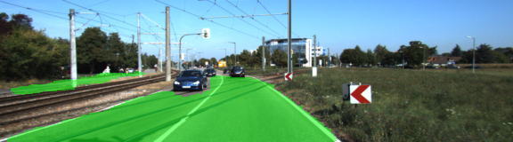
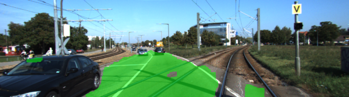
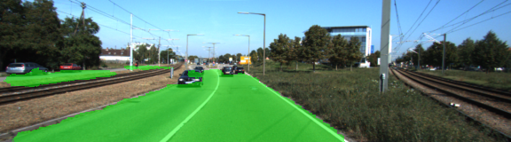

# Korda's Semantic Segmentation Fully Convolutional Neural Network for Udacity Self-driving Car Engineer Nanodegree




## This is my submission for the CarND-Semantic-Segmentation-Project described below.

## Click [Project Rubric](https://review.udacity.com/#!/rubrics/989/view) for specifications.

## A quick overview of what semantic segmentation is:
Semantic segmentation is the process of using a Fully Convolutional Neural Network to classify, at the pixel level, which parts of an image contain an object or class of interest. Usually, when using a neural network for image classification we are asking the network what class it believes is in the image as a whole, i.e. "this is an image of a cat". In semantic segmentation we are asking the network which pixel in the image contain a cat. This is very useful since there may be more than one class in an image, i.e. a cat and a dog. With semantic segmentation we can classify each pixel as belonging to a specific class or no class (background). 
### In this project we were asked to classify pixels as road or not road.

## Techniques for Semantic Segmentation:
The method for doing semantic segmentation that we learned in the lessons revolves around VGG16, a well known pre-trained image classifier. The details of how VGG16 is used as an encoder as well as converting it to a fully convolutional network as illustrated in [this paper.](https://people.eecs.berkeley.edu/~jonlong/long_shelhamer_fcn.pdf)

## My contributions and implementation:
We were given a template for `main.py` which needed to be filled in with the decoder (fully convolutional layers). We were also given `helper.py` functions. I implemented the following functions: `load_vgg()`, `layers()`, `optimize()`, `train_nn()`, `graph_visualize()`, and `run()`.

The function `load_vgg` loads the VGG16 pre-trained graph that will be used as the encoder.
The function `layers` contains the decoder of the network to preserve spatial information using 1x1 transpose convolutions.
The function `optimize` contains the AdamOptimizer which reduces the loss of the network during training.
The function `train_nn` contains the code to loop through the epochs and batches during training.
The function `graph_visualize` is used to visualize the original VGG16 graph. Below is the visualization:



The function `run` runs the training process.

Once implemented the tweaking began. I tuned the `LEARN_RATE = 9e-5`, `epochs = 25`, `batch_size = 4` to train properly and minimize loss while not eating up too much memory. The other items which were needed to get proper inferences were a kernel regularizer and initializer, as well as an addition of regularized loss. Code snippets of each as shown below:

```# KK Hyperparameters: Regularizer, Initializer, etc.
    l2_value = 1e-3
    kernel_reg = tf.contrib.layers.l2_regularizer(l2_value)
    stddev = 1e-3
    kernel_init = tf.random_normal_initializer(stddev=stddev)

    # KK 1x1 convolution to preserve spatial information
    conv_1x1_7 = tf.layers.conv2d(vgg_layer7_out, num_classes,
                                  kernel_size=1,
                                  strides=(1, 1),
                                  padding='same',
                                  kernel_regularizer=kernel_reg,
                                  kernel_initializer=kernel_init)
```

```
#KK Regularization loss collector
    reg_losses = tf.get_collection(tf.GraphKeys.REGULARIZATION_LOSSES)
    reg_constant = 0.01  # Choose an appropriate one.
    loss = cross_entropy_loss + reg_constant * sum(reg_losses)
```

## The final results:
Once properly tuned the FCN produced a trained loss of approximately 0.03. This led to very good classification of pixels that were considered road.

## Below are some examples of my implementations inferences (results):













### -------Original Udacity README Below-----------

# Semantic Segmentation
### Introduction
In this project, you'll label the pixels of a road in images using a Fully Convolutional Network (FCN).

### Setup
##### Frameworks and Packages
Make sure you have the following is installed:
 - [Python 3](https://www.python.org/)
 - [TensorFlow](https://www.tensorflow.org/)
 - [NumPy](http://www.numpy.org/)
 - [SciPy](https://www.scipy.org/)
##### Dataset
Download the [Kitti Road dataset](http://www.cvlibs.net/datasets/kitti/eval_road.php) from [here](http://www.cvlibs.net/download.php?file=data_road.zip).  Extract the dataset in the `data` folder.  This will create the folder `data_road` with all the training a test images.

### Start
##### Implement
Implement the code in the `main.py` module indicated by the "TODO" comments.
The comments indicated with "OPTIONAL" tag are not required to complete.
##### Run
Run the following command to run the project:
```
python main.py
```
**Note** If running this in Jupyter Notebook system messages, such as those regarding test status, may appear in the terminal rather than the notebook.

### Submission
1. Ensure you've passed all the unit tests.
2. Ensure you pass all points on [the rubric](https://review.udacity.com/#!/rubrics/989/view).
3. Submit the following in a zip file.
 - `helper.py`
 - `main.py`
 - `project_tests.py`
 - Newest inference images from `runs` folder  (**all images from the most recent run**)
 
 ## How to write a README
A well written README file can enhance your project and portfolio.  Develop your abilities to create professional README files by completing [this free course](https://www.udacity.com/course/writing-readmes--ud777).
